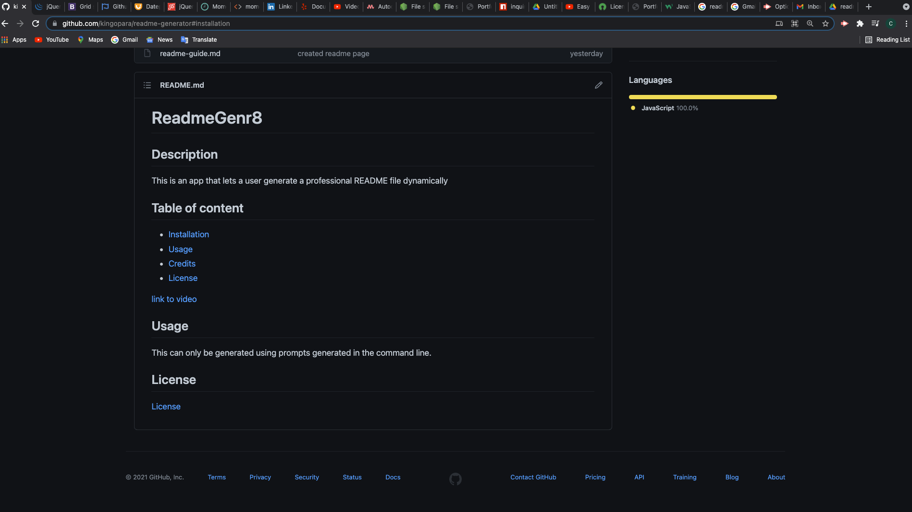

# readme-generator

## Description

This is an app that lets a user generate a professional README file dynamically from the command line using node.js

## Table of content

* [Installation](#installation)
* [Usage](#usage)
* [Credits](#credits)
* [License](#license)
* [Badges](#Badges)

[link to video](https://drive.google.com/file/d/18zonYW-Gj8jOxCWTVHaMmcnbM7gYcvkZ/view) 

## Preview

## Built with 
* Node.js

## Installation
To install the app on your device, you need to 

## Usage
This can only be generated using prompts generated in the command line.

use "node index.js" as the prompt to initialize the app from the command line.

## Credit
This app was made with love and hardwork by Praise Opara

## License

[MIT](https://opensource.org/licenses/MIT)

## Badges

## Contributing

](code_of_conduct.md)

